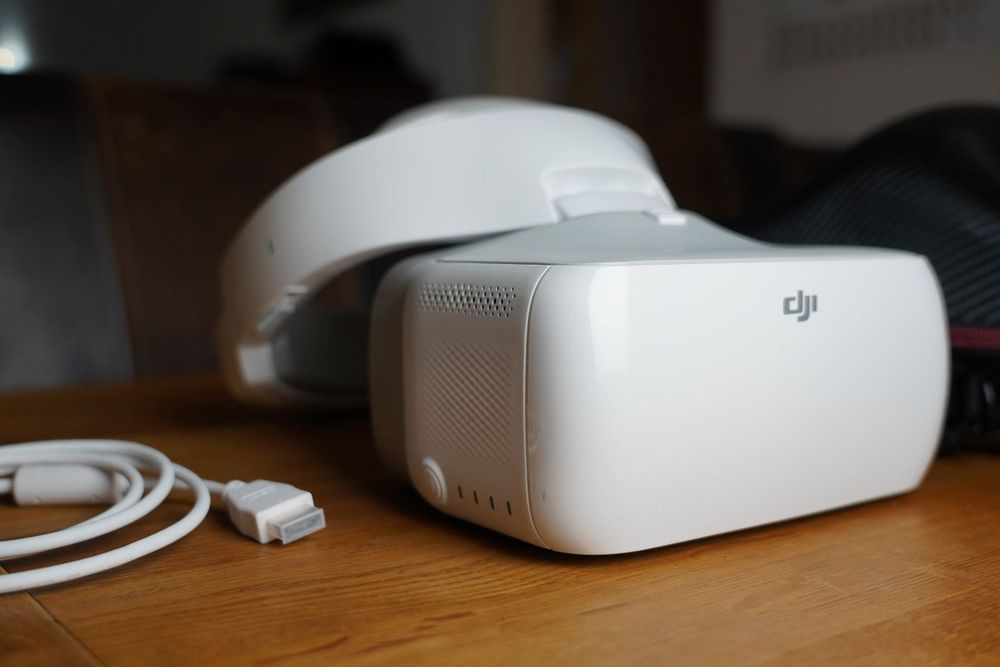

<b>Newspace final project Weather Balloon</b>

&nbsp;

$~~~~~~~~~~~$
# **Project Goal 🎯** 

Using two Raspberry Pi 3 computers linked by a TP-Link dongle, the project aims to build and implement a high-altitude weather balloon system. The main goal is to quickly ascend to an altitude of 30 km or higher and transmit a live video feed from the camera on the air station to the ground station. Using DJI VR technology, the live broadcast will be viewable on the ground station.

&nbsp;

-----
# **Summary**

Using two Raspberry Pi 3 computers connected by a TP-Link dongle, the project entails building a weather balloon system. The Raspberry Pi air station has a camera, while the Raspberry Pi ground station serves as the control panel. The air station's camera will record live video as the balloon quickly ascends to an altitude of 30 kilometers or higher.

To accomplish this, the ground station and air station will connect wirelessly via the TP-Link dongle. During the ascent, the camera on the air station Raspberry Pi will capture video footage, and the air station Raspberry Pi will transmit the live stream to the ground station in real time.

The live stream will be received and viewed on the ground station utilizing DJI VR technology. The user can watch the high-altitude environment from the perspective of the weather balloon in this unique viewing experience.

Aside from the live feed, the Raspberry Pi ground station will continue to gather and evaluate weather data supplied by the air station. This information, together with the live video feed, can be used for scientific research, weather analysis, and education.

In brief, the project's goal is to create a high-altitude weather balloon system out of Raspberry Pi machines linked via a TP-Link dongle. The apparatus will rapidly ascend to an height of 30 kilometers or higher and broadcast a live stream from the air station's camera. The live broadcast will be accessed on the ground station with DJI VR technology, providing an immersive picture of the high-altitude environment for research, analysis, and education.

$~~~~$

----

<b>Open sources being used</b>

| Open-HD   |
|:----:|
||

&nbsp;
|  WFB-NG  |
|:----:|
||

&nbsp;
| EZ-Wifibroadcast  |
|:----:|
||

 

&nbsp;

----

<b>Hardware</b>

| Raspberry PI 3 x2 with camera| TPLink| DJI-VR
|:----:|:----:| :----:|
||| |

&nbsp;

 Raspberry PI 3 description

------------------

&nbsp;
# LOG & Issues:

